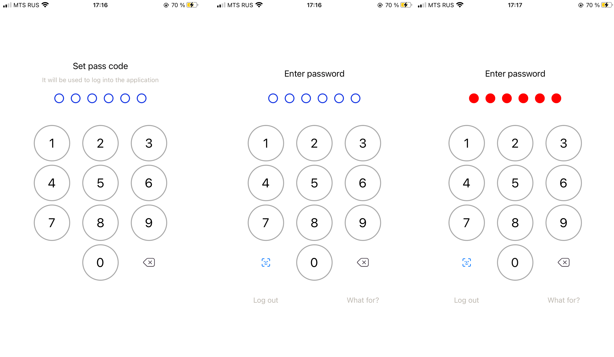
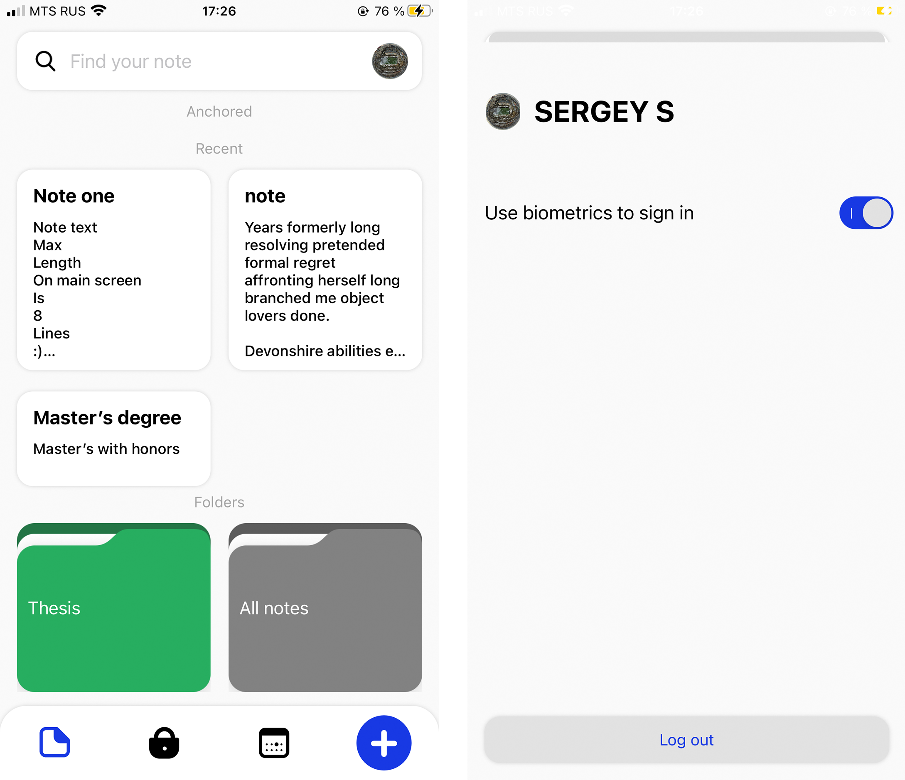
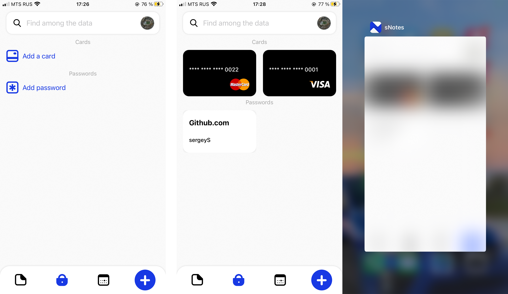
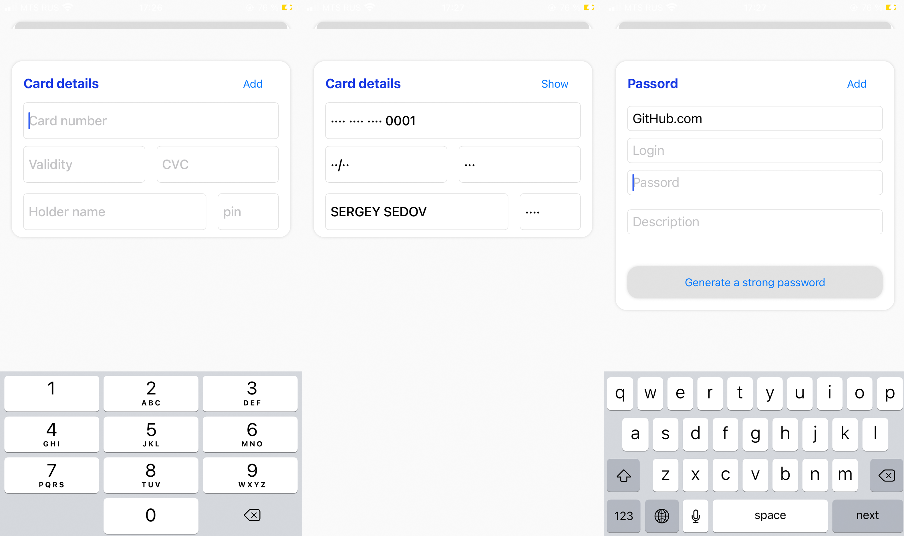
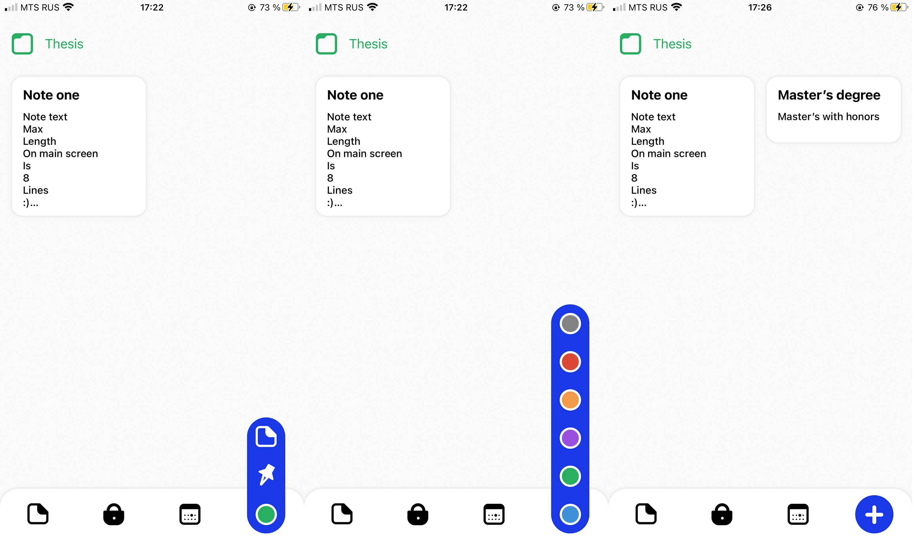

 #iOS app sNotes
 
 With this application, the user wont be able to worry about the protection of his data, he will be able to store reminder notes, store bank card data, and save passwords for websites.
 All data is stored locally and in a secure location, depending on the type of data.
 
##Application security
*Storage secure data in a keychain without iCloud sync.
*For data stored in the CoreData, used a symmetric encryption algorithm is ChaCha20-Poly1305 an implementation Apples [ChaChaPoly](https://developer.apple.com/documentation/cryptokit/chachapoly).

##UI App
___
###Login Screen

___
###Main Screen

___
###Locker Screen

___
###Card and Password Screen

___
###Folder Screen

##Localization app
At the moment the application supports 3 languages: Russian, English and Chinese. 
Localization supports:
* Localizable.strings
* Localizable.stringsdict
